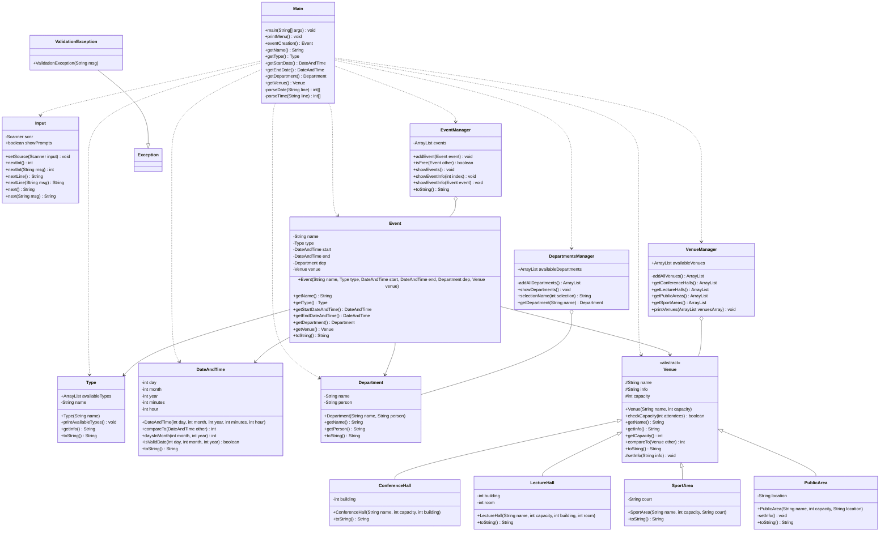
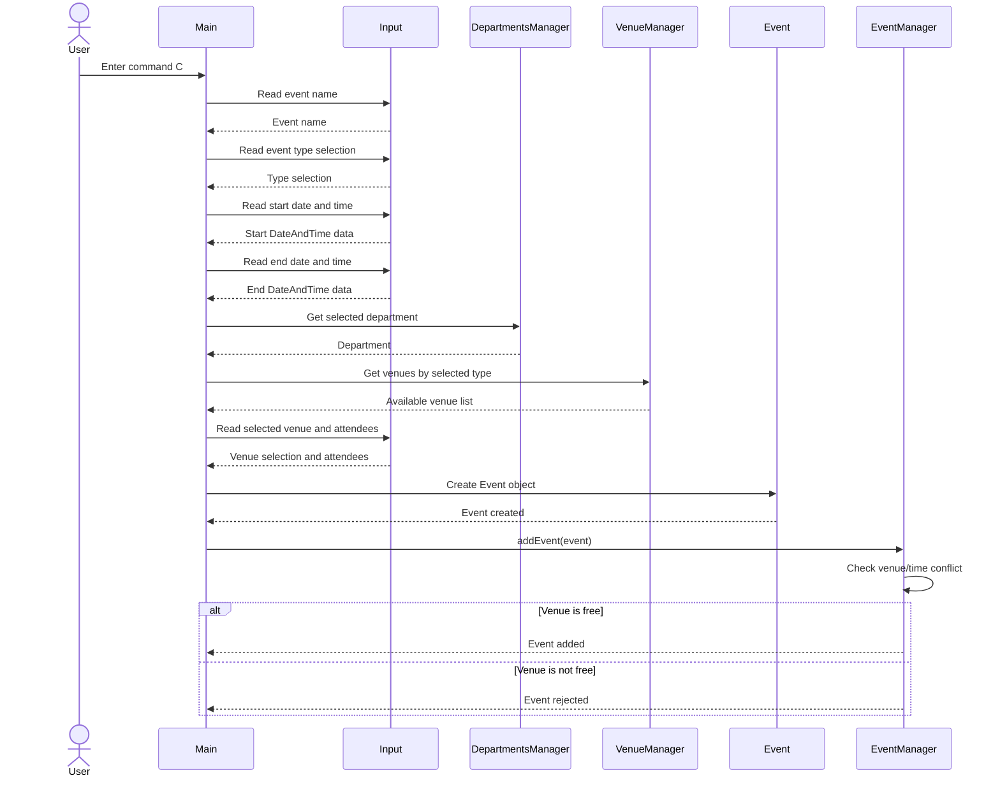

# 252ICSProject108 Documentation

## Project Overview

**252ICSProject108** is a Java console-based Event Managing System. It allows users to create and view events, assign each event to a department, select a venue, validate event dates and times, and prevent venue/time conflicts.

The application is organized into four main packages:

- `MAINS` - program entry point, user input handling, event type definitions, and custom validation exception.
- `EVENTS` - event model, event date/time model, and event scheduling manager.
- `DEPARTMENTS` - department model and department loader/manager.
- `VENUES` - abstract venue model, venue subclasses, and venue loader/manager.

---

## Repository Structure

```text
252ICSProject108/
├── DEPARTMENTS/
│   ├── Department.java
│   └── DepartmentsManager.java
├── EVENTS/
│   ├── DateAndTime.java
│   ├── Event.java
│   └── EventManager.java
├── MAINS/
│   ├── Input.java
│   ├── Main.java
│   ├── Type.java
│   └── ValidationException.java
├── VENUES/
│   ├── ConferenceHall.java
│   ├── LectureHall.java
│   ├── PublicArea.java
│   ├── SportArea.java
│   ├── Venue.java
│   └── VenueManager.java
├── Departments.txt
├── Venues.txt
├── Test.txt
└── README.pdf
```

---

## Main Features

1. **Create events**
   - Event name
   - Event type
   - Start date and time
   - End date and time
   - Department responsible for the event
   - Venue selection
   - Number of attendees

2. **Show all events**
   - Displays a formatted list of created events.

3. **Show event details**
   - Displays full information about a selected event, including department and venue details.

4. **Input validation**
   - Validates integer input.
   - Validates event type selection.
   - Validates department selection.
   - Validates venue selection.
   - Validates date and time values.
   - Validates venue capacity.

5. **Conflict prevention**
   - Prevents two events from using the same venue at overlapping times.

---

## How the Program Works

The application starts from `MAINS.Main`. It attempts to read input from a file specified by `fileName`. If the file is not found, the program switches to manual console entry.

The user can enter the following commands:

| Command | Description |
|---|---|
| `C` | Create a new event |
| `SE` | Show all events |
| `SI` | Show detailed information for one event |
| `Q` | Quit the program |

When creating an event, the program collects all event data, creates an `Event` object, and passes it to `EventManager.addEvent()`. The event manager checks for venue conflicts before adding the event to the internal list.

---

## Class Responsibilities

### `MAINS` Package

#### `Main`
Controls the application flow. It prints the menu, receives commands, creates events, and communicates with managers.

#### `Input`
Provides reusable static methods for safe user input, including `nextInt`, `nextLine`, and `next`.

#### `Type`
Represents an event type. The project currently supports:

- Academic
- Religious
- Sport
- Social

#### `ValidationException`
A custom checked exception used when user selections or business rules are invalid.

---

### `EVENTS` Package

#### `Event`
Represents a complete event. Each event has:

- Name
- Type
- Start date/time
- End date/time
- Department
- Venue

The constructor ensures that the start date/time is earlier than the end date/time.

#### `DateAndTime`
Represents a date and time. It validates:

- Day
- Month
- Year
- Hour
- Minute

It also implements comparison logic so events can be sorted and checked for overlapping time ranges.

#### `EventManager`
Stores and manages created events. It:

- Adds events in chronological order.
- Checks whether a venue is free.
- Shows all events.
- Shows detailed information for one event.

---

### `DEPARTMENTS` Package

#### `Department`
Represents a department and the person responsible for it.

#### `DepartmentsManager`
Loads departments from `Departments.txt`, displays available departments, validates department selections, and returns department objects.

---

### `VENUES` Package

#### `Venue`
An abstract base class for all venue types. It stores:

- Venue name
- Venue information
- Capacity

It also checks whether a venue can hold the requested number of attendees.

#### `ConferenceHall`
Represents a conference hall with a building number.

#### `LectureHall`
Represents a lecture hall with a building number and room number.

#### `SportArea`
Represents a sports venue with a court type.

#### `PublicArea`
Represents an open/public area with a location.

#### `VenueManager`
Loads venues from `Venues.txt`, separates venues by type, and prints venue lists for selection.

---

## UML Class Diagram



---

## UML Sequence Diagram: Creating an Event



---

## Important Business Rules

1. **Start time must be before end time**
   - `Event` throws an `IllegalArgumentException` if the start date/time is not earlier than the end date/time.

2. **Venue must have enough capacity**
   - `Venue.checkCapacity()` throws `ValidationException` if attendees exceed venue capacity.

3. **Venue cannot be double-booked**
   - `EventManager.isFree()` checks for overlapping events in the same venue.

4. **Selections must be valid**
   - Invalid department, venue, event type, or menu selections are handled with error messages and retries.

---

## Input Data Files

### `Departments.txt`
Stores department data in comma-separated format:

```text
DepartmentName, PersonInCharge
```

Example:

```text
ICS, Malak Baslyman
```

### `Venues.txt`
Stores venue data. The first value indicates venue type:

| Number | Venue Type |
|---|---|
| `1` | Conference Hall |
| `2` | Lecture Hall |
| `3` | Sport Area |
| `4` | Public Area |

Example:

```text
1, Building 24 Hall, 500, 24
2, Building 22 Lecture Hall, 300, 22, 111
3, Main Stadium, 500, Football
4, Escape Room, 5, AlKhobar
```

---

## How to Compile and Run

From the repository root, compile all Java files:

```bash
javac MAINS/*.java EVENTS/*.java DEPARTMENTS/*.java VENUES/*.java
```

Run the program:

```bash
java MAINS.Main
```

Make sure `Departments.txt` and `Venues.txt` are located in the repository root when running the program.

---

## Example Manual Workflow

1. Run the program.
2. Enter `C` to create an event.
3. Enter event name.
4. Select event type.
5. Enter start date and time.
6. Enter end date and time.
7. Select department.
8. Select venue type.
9. Select venue.
10. Enter number of attendees.
11. Enter `SE` to show all events.
12. Enter `SI` to show details for one event.
13. Enter `Q` to quit.

---

## Notes and Suggested Improvements

- Use generic types such as `ArrayList<Event>` and `ArrayList<Venue>` instead of raw `ArrayList`.
- Replace the placeholder `fileName = "[FILE_NAME_GOES_HERE]"` with a real file path or command-line argument.
- Add unit tests for date validation, capacity validation, and conflict detection.
- Improve file parsing so names with spaces are handled consistently.
- Consider separating console UI logic from business logic for easier testing and maintenance.
- Add a build tool such as Maven or Gradle.

